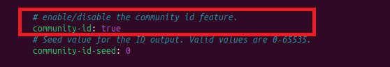

# Tool Introduction
Suricata is an open-source, high-performance network threat detection engine developed by the Open Information Security Foundation (OISF). It is designed to provide deep visibility into network traffic and to detect, prevent, and respond to modern cyber threats in real time.  <br><br>

Unlike traditional Intrusion Detection Systems (IDS), Suricata goes beyond simple pattern matching by combining IDS, IPS (Intrusion Prevention System), and Network Security Monitoring (NSM) capabilities into a single, versatile tool. With its powerful multi-threaded architecture, Suricata can analyze traffic at gigabit speeds, making it suitable for enterprise and high-traffic environments.  <br><br>

✨ Key Features
  * **Intrusion Detection & Prevention (IDS/IPS)**: Detects malicious activity using signature-based and anomaly-based methods, and can actively block threats when deployed in IPS mode.
  * **Deep Packet Inspection (DPI)**: Provides detailed insights by parsing application-layer protocols such as HTTP, TLS, DNS, FTP, and SMB.
  * **File Extraction & Logging**: Identifies and extracts files from network streams for further analysis, and supports JSON logging for SIEM/SOC integration.
  * **Threat Intelligence Integration**: Supports rule sets like Emerging Threats (ET) and custom signatures for tailored detection.
  * **Scalability**: Multi-threaded performance ensures high throughput on modern multi-core systems.
  * **Versatility**: Works as an IDS, IPS, or as a packet capture tool for traffic analysis.
<br>

🚀 Use Cases
  * Monitoring and analyzing suspicious network traffic.
  * Blocking intrusions at the gateway in IPS mode.
  * Collecting logs for SIEM integration (e.g., Wazuh, ELK, Splunk).
  * Forensics and incident response through packet capture and file extraction.
  * Research and lab environments to study malicious traffic behavior.

# Lab Description
This lab is designed to demonstrate the installation, configuration, and usage of Suricata as a network threat detection tool. The goal is to provide hands-on experience with deploying Suricata in a controlled environment and exploring its capabilities for Intrusion Detection, Intrusion Prevention, and Network Security Monitoring (NSM).

This lab focuses on installing and configuring Suricata, an open-source network threat detection engine, in a controlled environment. Students will deploy Suricata in IDS mode, apply community rule sets, and generate test traffic to observe alerts. The exercise provides hands-on experience with monitoring network traffic, analyzing Suricata logs, and understanding how IDS tools support real-world security operations.

# Prerequisites
1. Ubuntu Machine
2. Access to Internet

# Initial Setup
```
sudo apt update -y
```
```
sudo apt upgrade -y
```
```
sudo apt install build-essential curl dkms dnsutils tree vim vim-gtk3 -y
```
# Step 1
To begin installing Suricata, first add the Open Information Security Foundation (OISF) software repository to your Ubuntu system.
```
sudo add-apt-repository ppa:oisf/suricata-stable
```
<br>
<br><br>
As shown in Figure 1, press **ENTER** when prompted to confirm the addition of the repository. After the repository is added, the system automatically updates the list of available packages. <br><br>

In the next step, install Suricata using the following command.
```
sudo apt install suricata -y
```

After installing the package, enable the suricata.service so it runs automatically when the system restarts.
```
sudo systemctl enable suricata.service
```

# Step 2 - Configuring Suricata For The First Time
Suricata from the OISF repository comes with a ready-to-use configuration file that works for many common situations. By default, Suricata runs in IDS modendS (Intrusion Detection System) mode, which means it does not block traffic—it only monitors and logs suspicious activity.

Keeping Suricata in this default mode is recommended while you are learning, as it helps you understand alerts without risking disruption to network traffic. Once Suricata is fully set up, well-tested, and you understand the alerts it generates, you can switch to IPS (Intrusion Prevention System) mode to actively block malicious traffic.

Even though the default configuration is quite comprehensive, some settings may still need to be adjusted to better fit your specific environment and requirements.

# Step 3 - Enable Community Flow ID

Suricata can add a Community ID to its JSON logs. This ID acts like a shared label that helps link the same network activity across different security tools.

If you are using Suricata together with tools like Zeek or Elasticsearch, enabling the Community ID makes it much easier to correlate and compare events between them.

**In short:
Community ID = same flow, same ID, across multiple tools**

To turn this feature on, open the configuration file /etc/suricata/suricata.yaml using nano or any text editor you prefer.
```
sudo nano /etc/suricata/suricata.yaml
```

Go to line 120 in the file, where you will see # Community Flow ID.
If you are using nano, press CTRL + _, type 120, and press Enter to jump directly to that line.

Just below this comment, find the community-id setting and change its value to true.
This turns the feature on, as shown in Figure 2.

<br>
<br><br>
